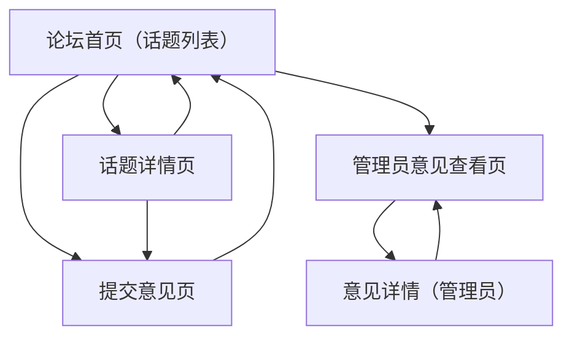

## 1. Product Overview
一个匿名在线论坛，包含“话题讨论”和“意见发布”两类功能：讨论区面向所有访客公开浏览与参与；意见区用于匿名提交反馈，仅管理员可查看。
不要求用户登录且不记录用户身份信息；管理员只能查看意见，不能发帖或参与讨论。

## 2. Core Features

### 2.1 User Roles
| 角色 | 注册/登录方式 | 核心权限 |
|------|----------------|----------|
| 匿名访客 | 无需注册/登录 | 浏览话题与讨论；创建话题；在话题下回帖；提交匿名意见（提交后不可查看列表） |
| 管理员 | 管理员登录（仅用于查看意见） | 仅可查看意见列表与详情；不可发布话题/回帖/提交意见 |

### 2.2 Feature Module
本产品由以下页面构成：
1. **论坛首页（话题列表）**：话题列表浏览、创建话题入口、跳转到话题详情、提交意见入口。
2. **话题详情页**：话题内容展示、回帖列表、发布回帖。
3. **提交意见页**：匿名提交意见、提交成功回执。
4. **管理员意见查看页**：管理员登录、意见列表与详情查看（只读）。

### 2.3 Page Details
| Page Name | Module Name | Feature description |
|-----------|-------------|---------------------|
| 论坛首页（话题列表） | 顶部导航 | 提供“论坛首页/提交意见/管理员入口”导航与站点标题 |
| 论坛首页（话题列表） | 话题列表 | 展示话题标题、发布时间、回帖数；支持分页/加载更多 |
| 论坛首页（话题列表） | 创建话题 | 发布新话题：输入标题与正文并提交；提交后跳转话题详情 |
| 话题详情页 | 话题展示 | 展示话题标题、正文、发布时间 |
| 话题详情页 | 回帖列表 | 按时间顺序展示回帖内容与发布时间；支持分页/加载更多 |
| 话题详情页 | 发布回帖 | 发布回帖正文并提交；提交后刷新回帖列表 |
| 提交意见页 | 意见表单 | 输入意见内容并提交（匿名）；提交后显示“已收到”回执 |
| 管理员意见查看页 | 管理员登录 | 提供管理员登录；未登录不可访问意见内容 |
| 管理员意见查看页 | 意见列表（只读） | 展示意见摘要、提交时间；支持筛选（如按时间）与分页 |
| 管理员意见查看页 | 意见详情（只读） | 查看完整意见内容与提交时间 |

## 3. Core Process
**匿名访客流程**：
- 进入论坛首页浏览话题列表 → 点击进入话题详情 → 阅读回帖 → 发布回帖。
- 在论坛首页点击“创建话题” → 填写标题与正文 → 发布成功后进入话题详情。
- 在任意页面进入“提交意见” → 填写意见 → 提交后仅获得成功回执（不提供意见列表/历史记录）。

**管理员流程**：
- 进入管理员入口 → 登录 → 查看意见列表 → 进入意见详情查看（全程只读，不能发帖/回帖/提交意见）。

