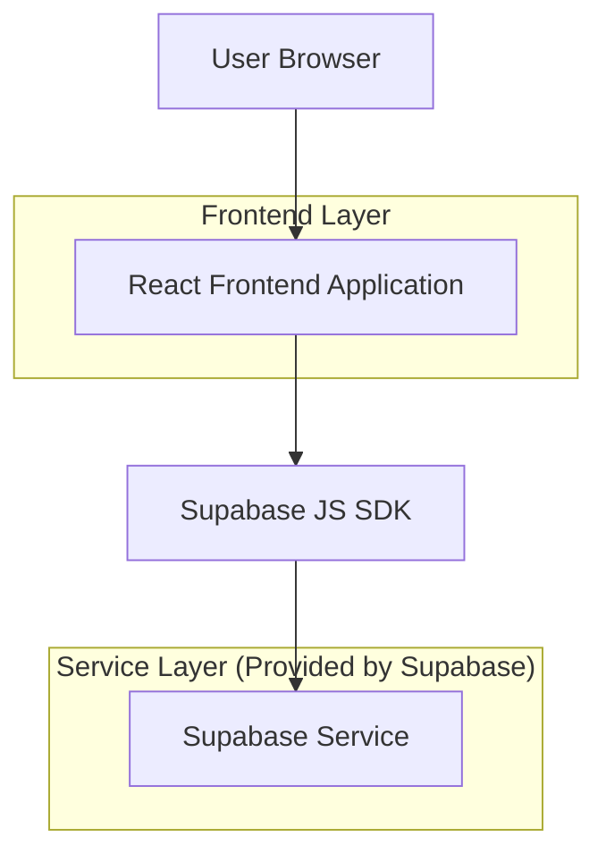
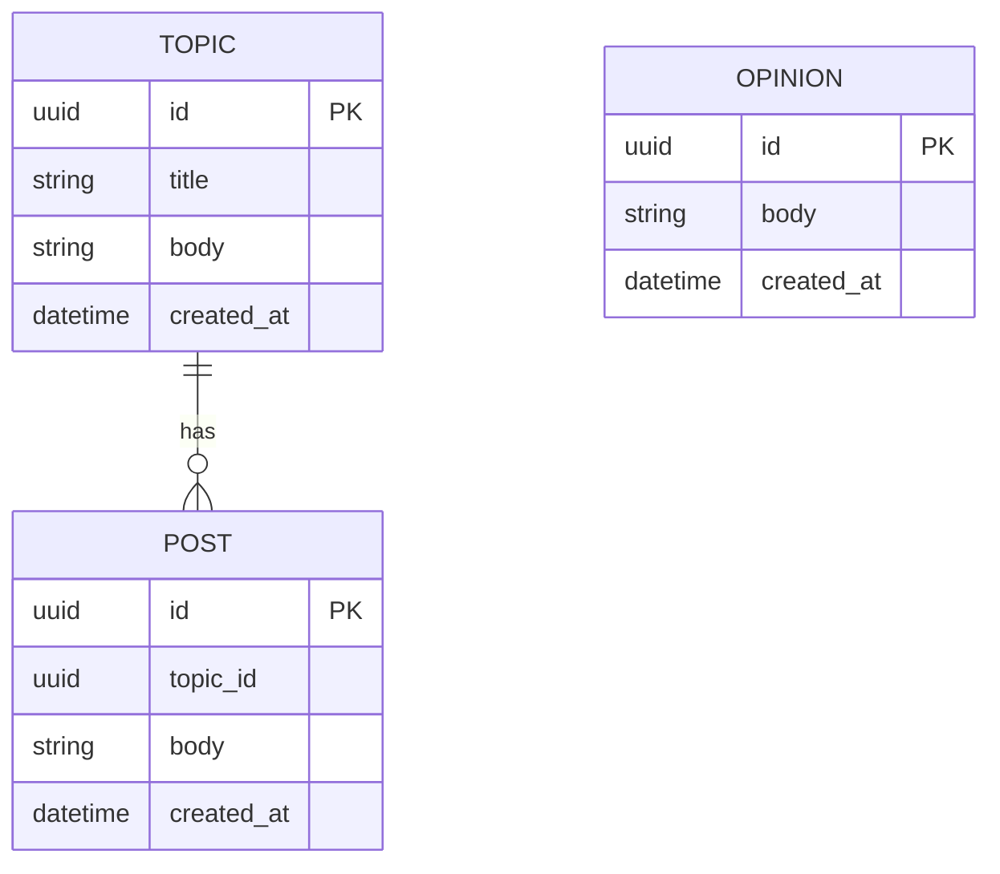

## 1.Architecture design


## 2.Technology Description
- Frontend: React@18 + vite + tailwindcss@3
- Backend: Supabase（Auth + PostgreSQL）

## 3.Route definitions
| Route | Purpose |
|-------|---------|
| / | 论坛首页：话题列表、创建话题入口、提交意见入口 |
| /topic/:id | 话题详情：阅读与回帖 |
| /opinion | 提交匿名意见（提交后仅回执） |
| /admin/login | 管理员登录 |
| /admin/opinions | 管理员只读查看意见列表与详情 |

## 6.Data model(if applicable)

### 6.1 Data model definition


### 6.2 Data Definition Language
Topic Table (topics)
```
CREATE TABLE topics (
  id UUID PRIMARY KEY DEFAULT gen_random_uuid(),
  title TEXT NOT NULL,
  body TEXT NOT NULL,
  created_at TIMESTAMPTZ NOT NULL DEFAULT NOW()
);
CREATE INDEX idx_topics_created_at ON topics(created_at DESC);
```

Post Table (posts)
```
CREATE TABLE posts (
  id UUID PRIMARY KEY DEFAULT gen_random_uuid(),
  topic_id UUID NOT NULL,
  body TEXT NOT NULL,
  created_at TIMESTAMPTZ NOT NULL DEFAULT NOW()
);
CREATE INDEX idx_posts_topic_id_created_at ON posts(topic_id, created_at ASC);
```

Opinion Table (opinions)
```
CREATE TABLE opinions (
  id UUID PRIMARY KEY DEFAULT gen_random_uuid(),
  body TEXT NOT NULL,
  created_at TIMESTAMPTZ NOT NULL DEFAULT NOW()
);
CREATE INDEX idx_opinions_created_at ON opinions(created_at DESC);
```

Security & Access (关键约束)
- 讨论区：匿名可读写 topics/posts。
- 意见区：匿名仅可插入 opinions；仅管理员可读取 opinions。
- 管理员能力：仅查看 opinions；在前端隐藏/禁用任何发帖入口，并在数据库层拒绝管理员对 topics/posts 的写入。

Supabase 权限建议（示意，实际以 RLS Policy 为准）
```
-- 基础公开读（可选）
GRANT SELECT ON topics TO anon;
GRANT SELECT ON posts TO anon;

-- 匿名可写讨论（如需）
GRANT INSERT, UPDATE, DELETE ON topics TO anon;
GRANT INSERT, UPDATE, DELETE ON posts TO anon;

-- 意见：匿名仅可写
GRANT INSERT ON opinions TO anon;

-- 登录用户（管理员）对 opinions 可读
GRANT ALL PRIVILEGES ON opinions TO authenticated;
```

RLS 策略建议（逻辑说明）
- topics/posts：允许 anon 与 authenticated 执行 SELECT/INSERT（是否允许更新/删除按产品是否需要编辑功能决定；默认不做编辑/删除）。
- opinions：允许 anon INSERT；仅允许管理员账号（基于 auth.uid() 白名单或自定义 claim）SELECT。
